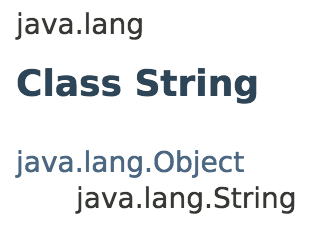
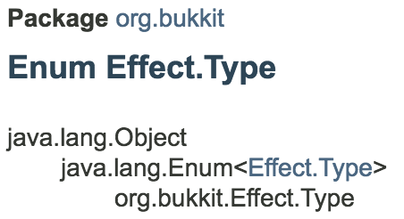

# Reading Javadocs

Most public APIs and libraries offer documentation in the form of Javadocs. Javadocs outline what features of a library are publicly accessible to developers.

Here are a few links to some commonly referenced Javadocs:  
[Java SE 8 Javadocs](https://docs.oracle.com/javase/8/docs/api/index.html?overview-summary.html)  
[Spigot Javadocs](https://hub.spigotmc.org/javadocs/bukkit/index.html?overview-summary.html)

## Fully qualified names

A fully qualified name is composed of a class's package and name. On the Javadoc of a class, this may be found near the top of the page. Fully qualified names are used when [importing classes](importing-classes.md).

If the name of the class contains a `.`, that is because the class is nested within another class. When referring to these classes, you must replace the `.` with a `$`.


Typically, nested classes should be [imported under an alias](importing-classes.md#dealing-with-nested-classes)!


## Non-public APIs

Javadocs do not describe everything available in a library. Most libraries include private classes, methods, fields, and constructors reserved for internal use. Using skript-mirror, these internal APIs are accessible just like any public API.

### Built-in inspection

skript-mirror has built-in tools for dumping all of the available members of an object. If you need a list of these members, including their return types and input parameters, you can use the [Members](utilities.md#members) expression. If you only need a list of names, you can use the [Member Names](utilities.md#member-names) expression.

### Source code

The best way to learn about how a library works is to read the source code! Many libraries will have their source code easily available online, though you may have to resort to decompiling libraries that are not open source.

[Craftbukkit source code](https://hub.spigotmc.org/stash/projects/SPIGOT/repos/craftbukkit/browse)  
[Online Java decompiler](http://www.javadecompilers.com/)

